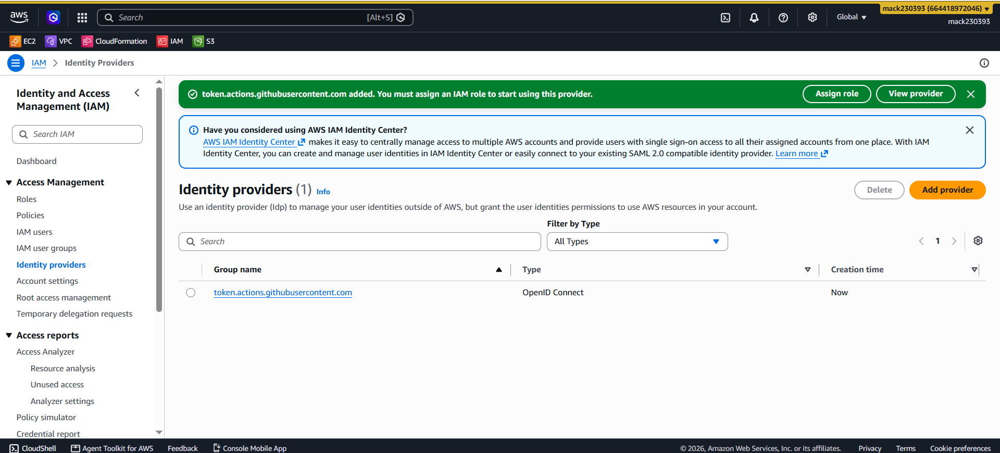
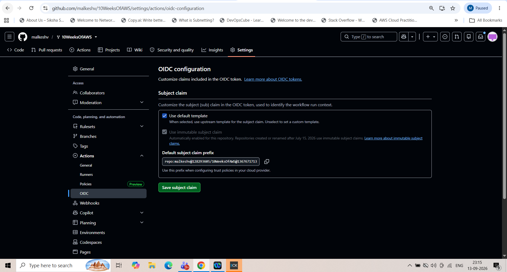
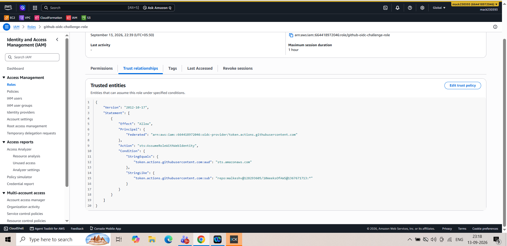
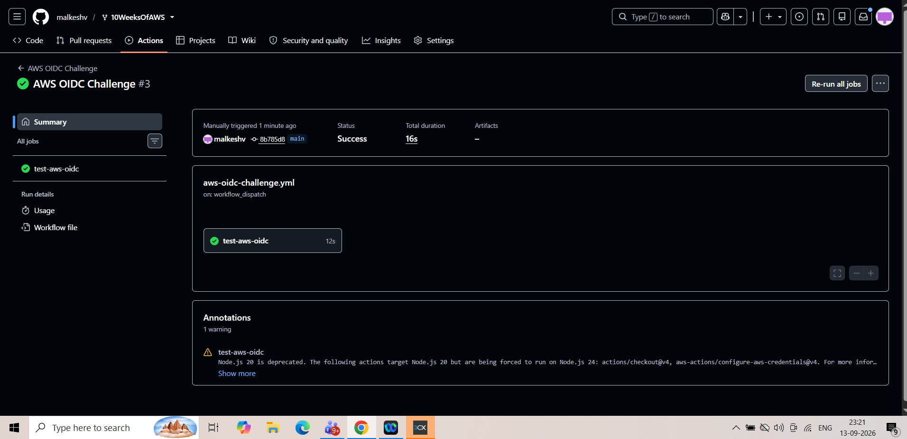

# Day 05 – GitHub OIDC with AWS IAM

## Objective

The objective of this challenge was to configure GitHub Actions to securely authenticate with AWS using OpenID Connect (OIDC), without using long-lived AWS access keys.

## What I implemented

- Created GitHub OIDC Identity Provider in AWS IAM.
- Configured the OIDC provider with:
  - Provider URL: `https://token.actions.githubusercontent.com`
  - Audience: `sts.amazonaws.com`
- Created IAM role:
  - Role Name: `github-oidc-challenge-role`
  - Trusted Entity: GitHub OIDC
- Attached `AmazonS3ReadOnlyAccess` to the IAM role.
- Configured the IAM trust policy to allow my GitHub repository to assume the role using OIDC.
- Configured GitHub Actions with:
  - `id-token: write`
  - `contents: read`
- Used `aws-actions/configure-aws-credentials@v4` to authenticate with AWS.
- Verified AWS authentication using:
  - `aws sts get-caller-identity`
  - `aws s3 ls`

## GitHub OIDC Configuration

The repository uses an immutable OIDC subject claim.

OIDC subject prefix:

`repo:malkeshv@128293605/10WeeksOfAWS@1367671713`

The AWS IAM trust policy was configured to match this subject.

## GitHub Actions Workflow

The workflow uses OIDC authentication instead of storing long-lived AWS credentials in GitHub Secrets.

```yaml
permissions:
  id-token: write
  contents: read

jobs:
  test-aws-oidc:
    runs-on: ubuntu-latest

    steps:
      - uses: actions/checkout@v4

      - uses: aws-actions/configure-aws-credentials@v4
        with:
          role-to-assume: arn:aws:iam::664418972046:role/github-oidc-challenge-role
          aws-region: us-west-2

      - run: aws sts get-caller-identity
      - run: aws s3 ls
```
## Verification

The GitHub Actions workflow completed successfully after configuring the IAM trust policy for the immutable OIDC subject claim.

### Screenshots

### 1. AWS OIDC Provider



### 2. GitHub OIDC Configuration



### 3. Updated IAM Trust Policy



### 4. GitHub Actions Successful Run



## Key Learning

GitHub Actions can authenticate with AWS using OIDC without storing long-lived AWS access keys.

The GitHub OIDC token is exchanged with AWS STS, which allows GitHub Actions to assume the configured IAM role.

This provides a more secure approach for CI/CD authentication because AWS credentials do not need to be stored as long-lived GitHub secrets.
