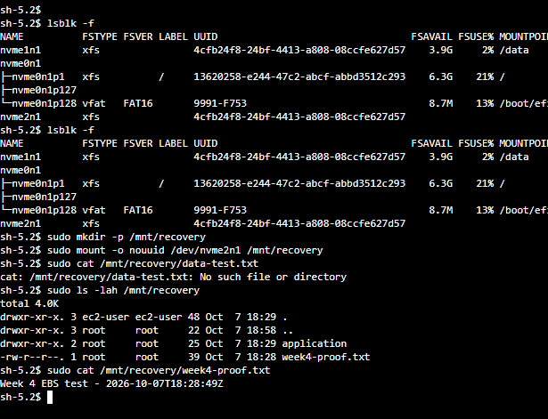
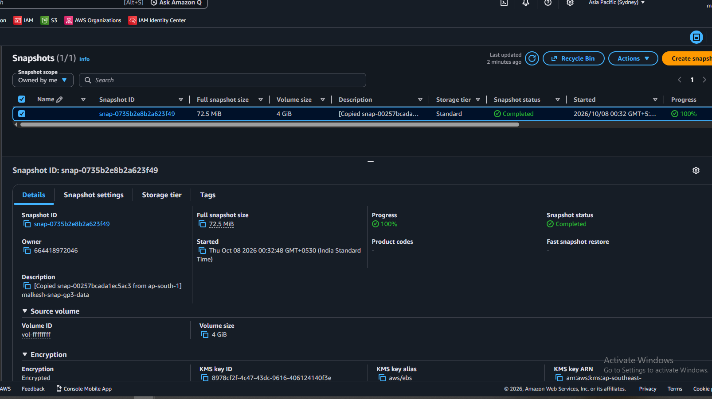

# Week 4 - Day 8: EBS Persistence, Snapshot Recovery & EFS

## Learner

- **Name:** Malkesh Waghela
- **GitHub:** malkeshv
- **Week:** 4
- **Day:** 8

---

## Overview

In Day 8, I worked with AWS storage services and practiced EBS persistence,
snapshot-based recovery, cross-Region disaster recovery, Data Lifecycle
Manager, Placement Groups, and shared file storage using Amazon EFS.

The main focus was understanding persistent block storage, backup and
recovery, disaster recovery, and shared storage across EC2 instances.

---

# 1. EBS gp3 Volume

## What I Practiced

- Created an encrypted EBS gp3 volume.
- Attached the volume to an EC2 instance.
- Created an XFS filesystem.
- Mounted the volume at `/data`.
- Created test data on the volume.
- Tested data persistence after EC2 restart.
- Resized the EBS volume from **2 GiB to 4 GiB**.
- Extended the XFS filesystem using `xfs_growfs`.
- Verified the filesystem size using `df -hT`.

## Actual Resources

- **EC2 Instance:** `malkesh-ec2-storage-lab`
- **EBS Volume:** `malkesh-ebs-gp3-data`
- **Volume ID:** `vol-0235652452edf9597`
- **Filesystem:** XFS
- **Initial Size:** 2 GiB
- **Final Size:** 4 GiB
- **Mount Point:** `/data`

## Evidence


---

# 2. EBS Snapshot

I created an EBS snapshot of the data volume to understand point-in-time
backup and recovery.

## Snapshot Details

- **Snapshot ID:** `snap-00257bcada1ec5ac3`
- **Source Volume:** `vol-0235652452edf9597`
- **Snapshot Size:** 4 GiB
- **Encryption:** Enabled
- **Status:** Completed

After creating the snapshot, I modified the live volume and restored the
snapshot to a new EBS volume.

## Evidence


---

# 3. Snapshot Restore & Point-in-Time Recovery

I created a new EBS volume from the snapshot and mounted it separately to
validate point-in-time recovery.

The restored volume contained the data that existed when the snapshot was
created, while changes made after the snapshot were not present.

This demonstrated that an EBS snapshot represents a point-in-time state of
the volume.

## Restore Details

- **Restored Volume:** `malkesh-ebs-restored`
- **Volume ID:** `vol-085bc447616d2889b`
- **Restored Device:** `/dev/nvme2n1`
- **Recovery Mount Point:** `/mnt/recovery`
- **Recovery File:** `week4-proof.txt`

## Evidence



---

# 4. Cross-Region Snapshot Copy

I copied the EBS snapshot from the Mumbai Region to the Sydney Region to
understand cross-Region disaster recovery.

## Regions

- **Source:** Mumbai - `ap-south-1`
- **Destination:** Sydney - `ap-southeast-2`

## Sydney Snapshot

- **Snapshot ID:** `snap-0735b2e8b2a623f49`
- **Status:** Completed
- **Encryption:** Enabled
- **Size:** 4 GiB

This demonstrated how an EBS snapshot can be copied to another AWS Region
for disaster recovery.

## Evidence



---

# 5. EBS Encryption Validation

I validated encryption across the EBS backup and recovery workflow.

The validation flow was:

```text
Encrypted EBS Volume
        |
        v
Encrypted EBS Snapshot
        |
        v
Restored Encrypted Volume
        |
        v
Encrypted Cross-Region Snapshot
